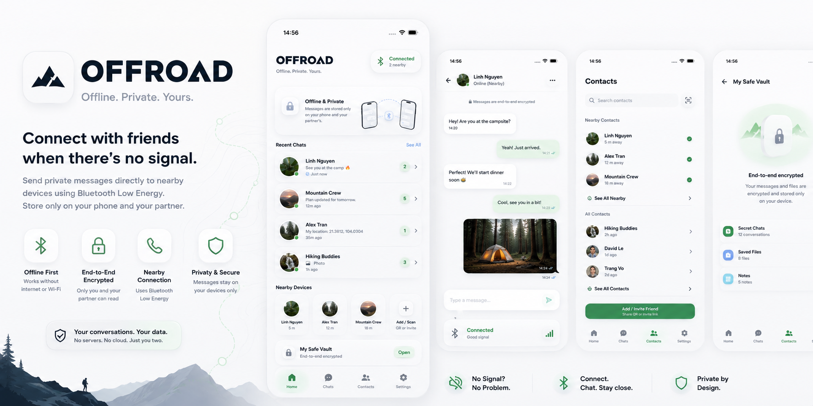

# OFFROAD

**Offline. Private. Yours.**

> Connect with friends when there's no signal.

OFFROAD is an iOS messaging app that works **without Internet or Wi-Fi**. Send private messages directly to nearby devices using **Bluetooth Low Energy** — no servers, no cloud, just you two.

## Key Features

- **Offline First** — Works without Internet or Wi-Fi. Chat anywhere: campsite, subway, festival, disaster zone.
- **End-to-End Encrypted** — Only you and your partner can read the messages.
- **Nearby Connection** — Discover and connect to nearby devices via Bluetooth Low Energy.
- **Privacy & Secure** — Messages stay on your devices only. No data leaves your phone.
- **Safe Vault** — Store secret chats, saved files, and notes locally with end-to-end encryption.

## Why OFFROAD?

Traditional messengers rely on cellular or Wi-Fi. OFFROAD doesn't. Whether you're hiking off-grid, in a crowded venue with no signal, or simply want conversations that never touch a server — OFFROAD keeps you connected and private.

Your conversations. Your data. No servers. No cloud. Just you two.
